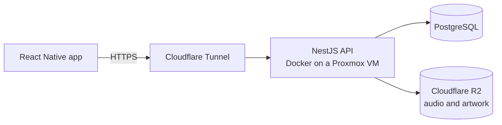

# Castaway

A self-hosted music streaming platform built around my personal CD library. Castaway covers the full stack: a NestJS API, a React Native mobile app, and the infrastructure that runs it on my own hardware.

## How the pieces fit

| Layer | Technology | Role |
|---|---|---|
| Mobile | React Native, Expo Router, TanStack Query, expo-audio | Playback with queue, shuffle, and repeat; browsing, search, and playlists |
| API | NestJS 11, TypeScript (strict) | REST API for the library, playlists, search, and accounts; streams audio to the app |
| Auth | JWT, Argon2, rotating refresh tokens | Short-lived access tokens, hashed refresh tokens with family revocation, routes protected by default |
| Database | PostgreSQL, Prisma 7 | Relational model for tracks, albums, artists, playlists, and play history |
| Storage | Cloudflare R2 (MinIO in development) | S3-compatible storage for audio files and album art |
| Infrastructure | Docker Compose, Proxmox, Cloudflare Tunnel | Runs on a self-hosted Linux VM and is exposed publicly without opening inbound ports |
| Docs and tests | Swagger/OpenAPI, Jest, Supertest | Generated API documentation, unit tests, and end-to-end tests |

## Repositories

- [`castaway-mobile`](https://github.com/castaway-ace/castaway-mobile): React Native client
- [`castaway-api`](https://github.com/castaway-ace/castaway-api): NestJS backend
